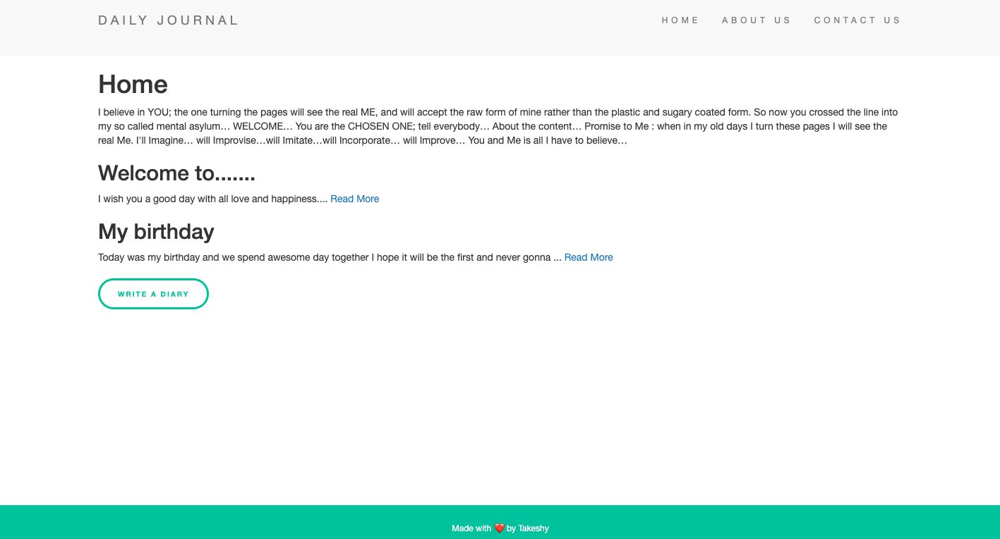

# Journal Diary

## Table of contents

- [Overview](#overview)
  - [Project goal](#project-goal)
  - [Screenshot](#screenshot)
  - [Links](#links)
- [My process](#my-process)
  - [Built with](#built-with)
  - [What I learned](#what-i-learned)
  - [Useful resources](#useful-resources)

## Overview

### Project goal

Users should be able to:

- Move between the sections of the project smoothly and the read the entire post in separate page.
- Write a new diary to the journal with 2 sections Title and Post.
- Edit or/and delete new or old post.

### Screenshot

### Links

- Live Site URL: [Journal Diary](https://journal-diary.herokuapp.com/)

## My process

### Built with

- Semantic HTML5 markup
- CSS custom properties
- Node.js
- Express.js
- EJS
- Mongoose
- MongoDB
- Npm

- [Node.js](https://nodejs.org/en/) - To establish a server with JS
- [Express](https://expressjs.com/) - Web framework for Node.js
- [EJS](https://ejs.co/) - Embedded javaScript templating
- [MongoDB](https://mongoosejs.com/) - Database
- [Npm](https://www.npmjs.com/) - Npm packages 

### What I learned

- How to create a website with server and database using node.js for the server and express to handle the requests and the responses also to manage static files in public folder, and with EJS I was able to using javascript inside html files. 
- How to used mongoose to make a schema for the and to cloud the data to mongodb.
- How implemented many packages so I used npm to keep it simple.

### Useful resources

- [method-override](https://www.npmjs.com/package/method-override) - This helped me for handling DELETE and PUT requests. I really liked its simplicity and efficiency.

